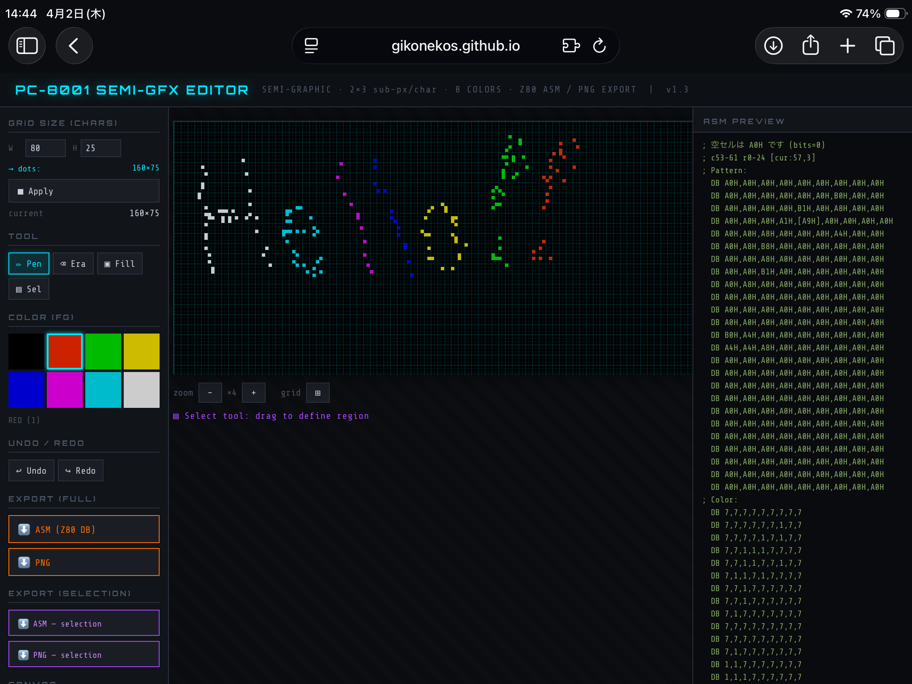

# PC-8001 Semi-Graphic Editor

**Browser-based semi-graphic pattern editor for the NEC PC-8001 home computer.**  
No install, no dependencies — open the HTML file and start drawing.

🎨 **[Open Editor](https://gikonekos.github.io/pc8001-semigfx-editor/pc8001-semigfx-editor.html)** &nbsp;|&nbsp; 📖 **[Manual](https://gikonekos.github.io/pc8001-semigfx-editor/pc8001-semigfx-editor-manual.html)**

---

## What makes this different

Existing PC-8001 tools such as **DumpListEditor** and **EMI AtrbViewer** are powerful Windows-based utilities for data inspection and attribute viewing. This editor is a **browser-based drawing front-end** — you draw directly, import images, and export Z80 ASM or PNG without leaving the browser.

---

## Screenshot



---

## Features

- **Semi-graphic character set** — codes `0xA0`–`0xBF`, 2×3 sub-pixels per cell (6 bits)
- **8-color palette** — faithful to PC-8001 hardware (BLACK / RED / GREEN / YELLOW / BLUE / MAGENTA / CYAN / WHITE)
- **4 Drawing tools** — Pen, Erase, Flood Fill, Select (rectangular region)
- **Right-click erase** — right-click or drag to erase sub-pixels without switching tools
- **Adjustable grid size** — 1–80 cols × 1–25 rows; real-time dot count display (W×2 × H×3)
- **Image import** — accepts PNG, JPEG and other browser-supported formats; auto-converted to PC-8001 constraints
- **PNG export** — native sub-pixel resolution output
- **Z80 ASM export** — `DB` byte format, pattern data + color attribute data separated
- **Save / Load (.p8g)** — saves complete edit state (grid size, all cell data, selected color); fully restored on reload
- **Live ASM preview** — cursor-centered, updates in real time; cursor cell highlighted with brackets
- **Color attribute warning** — warns when a row exceeds the hardware limit of 20 color changes
- **Undo / Redo** — 50 steps
- **Zoom** — ×1 to ×12, centered on screen
- **Keyboard shortcuts** — P / E / F / S / Ctrl+Z / Ctrl+Y
- **Single HTML file** — zero dependencies, works fully offline

> **Note:** All exported files (ASM, PNG) are saved to your browser's default download folder. The save destination cannot be selected due to browser security restrictions.

---

## Usage

```
git clone https://github.com/gikonekos/pc8001-semigfx-editor.git
```

Open `pc8001-semigfx-editor.html` in any modern browser. No server required.

Or use **GitHub Pages** directly:  
`https://gikonekos.github.io/pc8001-semigfx-editor/pc8001-semigfx-editor.html`

---

## Files

| File | Description |
|------|-------------|
| `pc8001-semigfx-editor.html` | Editor application |
| `pc8001-semigfx-editor-manual.html` | Specification & user manual (EN/JA) |
| `README.md` | This file |

---

## Changelog

| Version | Date | Changes |
|---------|------|---------|
| v1.4 | 2026-04-02 | Fix stale drag-state bug after tool switch; harden mousemove against missing mouseup; add Save/Load (.p8g edit state) |
| v1.3 | 2026-04-02 | Right-click erase; zoom centered on screen center with scrollbar support; ASM preview cursor-centered real-time display with bracket highlight; image import (PNG/JPEG auto convert) |
| v1.2 | 2026-04-02 | Fix grid right/bottom border lines; ASM preview scrollbar; color attribute >20 warning; version label in header |
| v1.1 | 2026-04-02 | Default size 80×25 chars (160×75 dots); real-time dot count on size input; fix Apply button on second press; ASM preview blank cell note |
| v1.0 | 2026-04-02 | Initial release |

---

## License

MIT License — see [LICENSE](LICENSE) for details.

---

---

# PC-8001 セミグラフィックエディタ

**NEC PC-8001 用ブラウザベースのセミグラフィックパターンエディタ。**  
インストール不要・外部依存なし。HTML ファイルを開くだけで動作します。

🎨 **[エディタを開く](https://gikonekos.github.io/pc8001-semigfx-editor/pc8001-semigfx-editor.html)** &nbsp;|&nbsp; 📖 **[マニュアル](https://gikonekos.github.io/pc8001-semigfx-editor/pc8001-semigfx-editor-manual.html)**

---

## 既存ツールとの違い

**DumpListEditor** や **EMI AtrbViewer** などの既存PC-8001向けツールは、データ検査や属性確認に強力なWindows系ユーティリティです。このエディタは**ブラウザで直接描ける制作フロントエンド**です。描いて、画像を読み込んで、Z80 ASMやPNGに出力する、という作業がブラウザだけで完結します。

---

## 機能一覧

- **セミグラフィック文字セット対応** — コード `0xA0`〜`0xBF`、セルあたり2×3サブピクセル（6ビット）
- **8色パレット** — PC-8001ハードウェア準拠（黒/赤/緑/黄/青/マゼンタ/シアン/白）
- **4種類の描画ツール** — ペン・消しゴム・塗りつぶし・選択（矩形範囲）
- **右クリック消去** — ツール切り替え不要でサブピクセルを消去・ドラッグで連続消去
- **グリッドサイズ可変** — 1〜80列 × 1〜25行；リアルタイムドット数表示（W×2 × H×3）
- **画像読み込み** — PNG、JPEGなど対応；PC-8001制約へ自動変換
- **PNGエクスポート** — サブピクセル等倍解像度で出力
- **Z80 ASMエクスポート** — `DB`バイト形式、パターンデータ＋カラーアトリビュートデータ分離出力
- **セーブ/ロード（.p8g）** — グリッドサイズ・全セルデータ・選択色を保存；完全復元可能
- **ライブASMプレビュー** — カーソル中心でリアルタイム更新；カーソルセルを括弧でハイライト
- **カラーアトリビュート警告** — 1行あたり20回を超える色変更を警告表示
- **Undo / Redo** — 50ステップ
- **ズーム** — ×1〜×12、画面中心固定
- **キーボードショートカット** — P / E / F / S / Ctrl+Z / Ctrl+Y
- **シングルファイルHTML** — 外部依存なし、完全オフライン動作

> **注意：** エクスポートファイル（ASM、PNG）はブラウザのデフォルトダウンロードフォルダに保存されます。ブラウザのセキュリティ制約により、保存先を選択することはできません。

---

## 使い方

```
git clone https://github.com/gikonekos/pc8001-semigfx-editor.git
```

`pc8001-semigfx-editor.html` をモダンブラウザで開いてください。サーバー不要。

または **GitHub Pages** から直接：  
`https://gikonekos.github.io/pc8001-semigfx-editor/pc8001-semigfx-editor.html`

---

## ファイル構成

| ファイル | 内容 |
|----------|------|
| `pc8001-semigfx-editor.html` | エディタ本体 |
| `pc8001-semigfx-editor-manual.html` | 仕様書・利用マニュアル（英日） |
| `README.md` | このファイル |

---

## バージョン履歴

| バージョン | 日付 | 変更内容 |
|------------|------|----------|
| v1.4 | 2026-04-02 | ツール切り替え時のstaleドラッグ状態バグ修正；mousemoveのmouseup取りこぼし対策；セーブ/ロード（.p8g編集状態）追加 |
| v1.3 | 2026-04-02 | 右クリック消去；ズーム画面中心固定・スクロールバー対応；ASMプレビューカーソル中心リアルタイム表示（括弧ハイライト）；画像読み込み（PNG/JPEG自動変換） |
| v1.2 | 2026-04-02 | グリッド右端・下端の枠線修正；ASMプレビュースクロールバー；カラーアトリビュート20回超え警告；ヘッダーバージョン表記 |
| v1.1 | 2026-04-02 | デフォルトサイズ80×25文字（160×75ドット）；サイズ入力時リアルタイムドット数表示；Applyボタン2回目不可バグ修正；ASMプレビュー空セル説明追加 |
| v1.0 | 2026-04-02 | 初期リリース |

---

## ライセンス

MIT License — 詳細は [LICENSE](LICENSE) をご覧ください。
